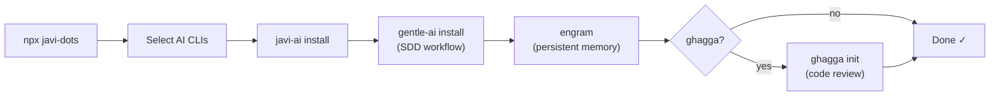

# javi-dots

> Developer workstation setup — AI CLIs, SDD, memory, and code review in one command

[](https://www.npmjs.com/package/javi-dots)
[](LICENSE)

## Quick Start

```bash
npx javi-dots
```

That's it. An interactive TUI walks you through selecting AI CLIs, then installs everything: skills, configs, orchestrators, persistent memory, SDD workflow, and optionally code review.

## What It Does

See [Workstation Replication](docs/replication.md) for the safe portable profile contract.

`javi-dots` is the single entry point for setting up an AI-powered developer workstation. It orchestrates multiple tools so you don't have to install them one by one.



### Setup Steps

| Step | Component | Required | Description |
|------|-----------|----------|-------------|
| 1 | **javi-ai** | ✅ | Installs skills, configs, and orchestrators for selected CLIs |
| 2 | **gentle-ai** | ✅ | Installs and configures the SDD (Spec-Driven Development) framework |
| 3 | **engram** | ✅ | Installs persistent AI memory via Homebrew, configures per CLI |
| 4 | **ghagga** | ❌ | Optional multi-agent code review system |
| 5 | **rtk** | ❌ | Token compressor — intercepts shell output, saves 60-90% context tokens |

## Presets

| Preset | CLIs | ghagga | TUI |
|--------|------|--------|-----|
| `full` | All 6 (Claude, OpenCode, Gemini, Qwen, Codex, Copilot) | ✅ | Skipped |
| `minimal` | Claude only | ❌ | Skipped |
| `custom` | Interactive selection | Interactive | Full TUI |

```bash
# Full preset — everything, no prompts
npx javi-dots --preset full

# Minimal — Claude only
npx javi-dots --preset minimal

# Custom — interactive TUI (default)
npx javi-dots
```

All commands work in non-TTY environments (pipes, subprocesses).

## Commands

| Command | Description |
|---------|-------------|
| `setup` | Set up developer workstation (default) |
| `doctor` | Show health report of current installation |
| `update` | Re-run setup for previously configured CLIs |
| `uninstall` | Remove javi-dots managed files and manifests |
| `replication export` | Export a portable new-PC replication profile |
| `replication show` | Print the portable replication profile JSON |
| `health` | Audit AI agent config quality (CLAUDE.md, skills, MCP, hooks) |
| `esp` | Claude ESP tmux integration (toggle split pane with ESP watcher) |
| `mcp` | MCP server auto-setup (bootstraps default server: engram) |
| `tokens` | Token tracking with `.wolf/` ledger, repeated read detection |
| `nano <desc>` | SDD-lite inline workflow (challenge, plan, build, review) |
| `efficiency on <id>` | Activate token-efficiency profile (concise, automation, exploratory) |
| `efficiency off` | Deactivate current efficiency profile |
| `efficiency list` | List available efficiency profiles |
| `efficiency status` | Show current efficiency profile |

```bash
npx javi-dots setup        # same as just: npx javi-dots
npx javi-dots doctor       # check installation health
npx javi-dots update       # re-apply with same config
npx javi-dots uninstall    # clean removal
npx javi-dots replication export  # write ~/.javidots/replication-profile.json
npx javi-dots health       # audit CLAUDE.md, skills, MCP config, hooks
npx javi-dots esp          # install ESP tmux toggle (Ctrl-e)
npx javi-dots mcp          # bootstrap default MCP servers
npx javi-dots tokens       # show token usage report from .wolf/ ledger
npx javi-dots nano "add error boundary"  # SDD-lite: challenge → plan → build → review
npx javi-dots efficiency on concise      # activate concise mode (~63% output reduction)
npx javi-dots efficiency off             # back to normal mode
```

## CLI Flags

| Flag | Type | Default | Description |
|------|------|---------|-------------|
| `--dry-run` | boolean | `false` | Preview changes without writing anything |
| `--preset` | string | `custom` | Preset: `full`, `minimal`, `custom` |
| `--cli` | string | — | Comma-separated CLIs: `claude,opencode,gemini,qwen,codex,copilot` |
| `--ghagga` | boolean | — | Enable ghagga code review |
| `--no-ghagga` | boolean | — | Disable ghagga code review |

Flags override presets. If you pass both `--cli` and `--ghagga`/`--no-ghagga`, the TUI is skipped entirely:

```bash
npx javi-dots setup --cli claude,opencode --ghagga --dry-run
```

## What Gets Installed

### javi-ai

The AI development layer installer. Deploys skills, configs, orchestrators, hooks, and plugins to `~/.claude/`, `~/.config/opencode/`, `~/.gemini/`, etc. depending on which CLIs you selected.

👉 See [javi-ai](https://github.com/JNZader/javi-ai)

### gentle-ai (SDD)

Spec-Driven Development framework. Installed via Homebrew (`brew trust --formula gentleman-programming/tap/gentle-ai && brew install gentleman-programming/tap/gentle-ai`) and configured non-interactively with `gentle-ai install --agent <list> --preset full-gentleman --persona custom`. Provides structured planning workflows: `proposal → spec → design → tasks → apply → verify`.

### engram

Persistent AI memory system. Installed via Homebrew (`brew install gentleman-programming/tap/engram`). Each CLI gets its own engram configuration so conversations persist across sessions.

### rtk (optional)

Rust Token Killer. Intercepts shell command output and compresses it before it reaches the LLM context window, saving 60-90% of tokens on verbose command output. Installed via Homebrew (`brew install rtk-ai/tap/rtk`) or Cargo (`cargo install rtk`). During setup, `rtk init -g` creates a global config.

To toggle RTK on/off per session, use `rtk on` / `rtk off` in your shell.

### ghagga (optional)

Multi-agent code review system. When enabled, runs `ghagga init` to configure consensus-based AI code review in your projects.

👉 See [ghagga](https://github.com/JNZader/ghagga)

## Manifest

Configuration is saved to `~/.javidots/manifest.json`. The `update` and `uninstall` commands read this manifest to know what was installed.

## Requirements

- **Node.js** ≥ 18
- **git** — required for general repo workflows
- **brew** — required for installing engram (macOS/Linux)

## Ecosystem

| Package | Description |
|---------|-------------|
| [javi-dots](https://github.com/JNZader/javi-dots) | Workstation setup (this package) |
| [javi-ai](https://github.com/JNZader/javi-ai) | AI development layer — skills, configs, orchestrators |
| [javi-forge](https://github.com/JNZader/javi-forge) | Project scaffolding — CI, templates, AI bootstrap |

## License

[MIT](LICENSE)
