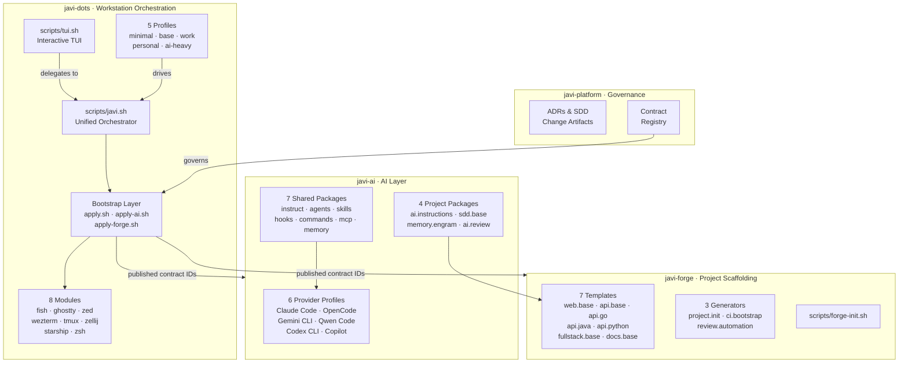
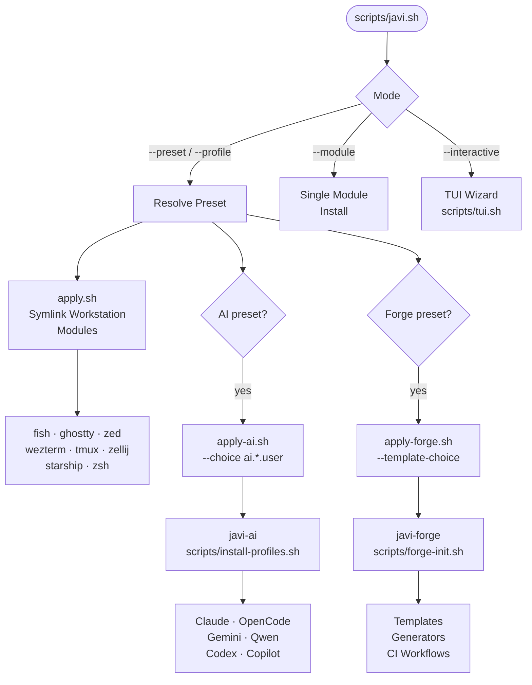
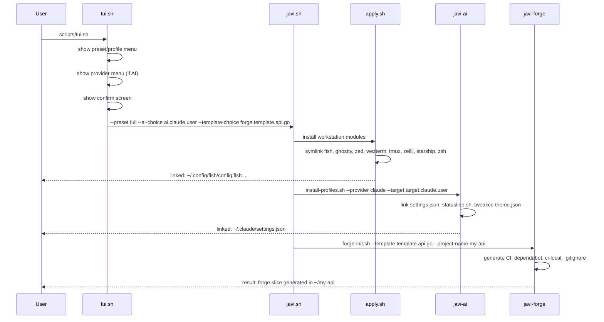

# javi-dots

> **Opinionated development machine setup.** One command to go from a fresh machine to a fully configured workstation — with AI coding tools, project scaffolding, and a beautiful terminal environment.

[](https://jnzader.github.io/javi-dots/)
[](LICENSE)

---

## Ecosystem Architecture



---

## How it works



---

## Bootstrap Sequence



---

## Quick Start

```bash
# Clone
git clone https://github.com/JNZader/javi-dots.git
cd javi-dots

# Option 1 — Interactive TUI (easiest)
scripts/tui.sh

# Option 2 — Apply a preset directly
scripts/javi.sh --preset base --home "$HOME"

# Option 3 — Apply a named profile
scripts/javi.sh --profile work --ai-choice ai.claude.user --home "$HOME"

# Option 4 — Install a single module
scripts/javi.sh --module tmux --home "$HOME"
```

> **Always preview first with `--dry-run`:**
> ```bash
> scripts/javi.sh --preset base --dry-run --home "$HOME"
> ```

---

## Presets

| Preset | What it installs | AI required |
|--------|-----------------|-------------|
| `base` | fish · ghostty · zed | — |
| `ai-core` | base + one AI provider profile | `--ai-choice` |
| `ai-full` | base + shared AI packages + one AI provider | `--ai-choice` |
| `forge` | base + forge project scaffolding | optional |
| `full` | base + AI + forge | `--ai-choice` |

```bash
scripts/javi.sh --list-presets
```

---

## Profiles

| Profile | Composition | Recommended for |
|---------|-------------|-----------------|
| `minimal` | base only | VMs, servers, clean baseline |
| `work` | base + ai-core | Work laptops, single provider |
| `personal` | base + ai-full + forge | Personal machines, full workflow |
| `ai-heavy` | base + all 6 AI providers | AI research, multi-provider setup |

```bash
# Apply work profile
scripts/javi.sh --profile work --ai-choice ai.claude.user --home "$HOME"

# Apply ai-heavy profile (no --ai-choice needed)
scripts/javi.sh --profile ai-heavy --home "$HOME"
```

---

## Modules

| Module ID | Config file | Install target |
|-----------|------------|----------------|
| `fish` | `config.fish`, `nvm.fish`, `fish_plugins` | `~/.config/fish/` |
| `ghostty` | `config`, `cursor_smear_gentleman.glsl` | `~/.config/ghostty/` |
| `zed` | `settings.json`, `keymap.json` | `~/.config/zed/` |
| `wezterm` | `.wezterm.lua` | `~/.wezterm.lua` |
| `tmux` | `tmux.conf` | `~/.tmux.conf` |
| `zellij` | `config.kdl`, `layouts/` | `~/.config/zellij/` |
| `starship` | `starship.toml` | `~/.config/starship.toml` |
| `zsh` | `.zshrc`, `.p10k.zsh` | `~/.zshrc`, `~/.p10k.zsh` |

```bash
# Install a single module
scripts/javi.sh --module tmux --home "$HOME"

# List all available modules
scripts/javi.sh --list-modules
```

---

## TUI Installer

```bash
scripts/tui.sh              # launch interactive installer
scripts/tui.sh --dry-run    # preview without executing
```

The TUI uses `whiptail` (available on most Linux distros and macOS via `brew install newt`) and falls back to plain prompts if not available. It guides you through preset → provider → confirm.

---

## AI Integration

javi-dots delegates all AI installation to [javi-ai](https://github.com/JNZader/javi-ai) via published contract IDs.

```bash
# See available AI provider choices
scripts/bootstrap/apply-ai.sh --list-choices

# Apply base + Claude Code + shared AI skills/hooks
scripts/javi.sh --preset ai-full --ai-choice ai.claude.user --home "$HOME"
```

Supported providers: Claude Code · OpenCode · Gemini CLI · Qwen Code · Codex CLI · GitHub Copilot

---

## Forge Integration

javi-dots delegates project scaffolding to [javi-forge](https://github.com/JNZader/javi-forge) via published contract IDs.

```bash
# See available forge templates and generators
scripts/bootstrap/apply-forge.sh --list-choices

# Generate a Go API project with review automation
scripts/javi.sh --preset forge \
  --template-choice forge.template.api.go \
  --generator-choice forge.generator.review.automation \
  --project-name my-api \
  --home "$HOME"
```

---

## Documentation

Full documentation is available at **[jnzader.github.io/javi-dots](https://jnzader.github.io/javi-dots/)**.

- [Getting Started](https://jnzader.github.io/javi-dots/#/getting-started)
- [Modules](https://jnzader.github.io/javi-dots/#/modules)
- [Profiles](https://jnzader.github.io/javi-dots/#/profiles)
- [AI Integration](https://jnzader.github.io/javi-dots/#/ai-integration)
- [Forge Integration](https://jnzader.github.io/javi-dots/#/forge-integration)
- [TUI Guide](https://jnzader.github.io/javi-dots/#/tui)
- [Architecture](https://jnzader.github.io/javi-dots/#/architecture)

---

## Ecosystem

| Repo | Role |
|------|------|
| **javi-dots** | Workstation setup, orchestration layer |
| [javi-ai](https://github.com/JNZader/javi-ai) | AI provider profiles, shared packages |
| [javi-forge](https://github.com/JNZader/javi-forge) | Project templates, generators |
| [javi-platform](https://github.com/JNZader/javi-platform) | Governance, ADRs, SDD artifacts |
