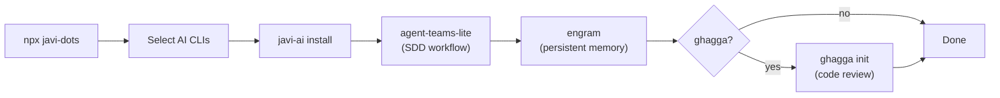

# javi-dots

> Developer workstation setup — AI CLIs, SDD, memory, and code review in one command

[](https://www.npmjs.com/package/javi-dots)
[](LICENSE)

## Quick Start

```bash
npx javi-dots
```

That's it. An interactive TUI walks you through selecting AI CLIs, then installs everything: skills, configs, orchestrators, persistent memory, SDD workflow, and optionally code review.

## What It Does

`javi-dots` is the single entry point for setting up an AI-powered developer workstation. It orchestrates multiple tools so you don't have to install them one by one.



### Setup Steps

| Step | Component | Required | Description |
|------|-----------|----------|-------------|
| 1 | **javi-ai** | Yes | Installs skills, configs, and orchestrators for selected CLIs |
| 2 | **agent-teams-lite** | Yes | Clones and configures the SDD (Spec-Driven Development) framework |
| 3 | **engram** | Yes | Installs persistent AI memory via Homebrew, configures per CLI |
| 4 | **ghagga** | No | Optional multi-agent code review system |

## Presets

| Preset | CLIs | ghagga | TUI |
|--------|------|--------|-----|
| `full` | All 6 (Claude, OpenCode, Gemini, Qwen, Codex, Copilot) | Yes | Skipped |
| `minimal` | Claude only | No | Skipped |
| `custom` | Interactive selection | Interactive | Full TUI |

```bash
# Full preset — everything, no prompts
npx javi-dots --preset full

# Minimal — Claude only
npx javi-dots --preset minimal

# Custom — interactive TUI (default)
npx javi-dots
```

## Supported AI CLIs

| CLI | Description |
|-----|-------------|
| **Claude Code** | Anthropic's CLI for Claude |
| **OpenCode** | Open-source AI coding assistant |
| **Gemini CLI** | Google's Gemini CLI |
| **Qwen** | Alibaba's Qwen CLI |
| **Codex CLI** | OpenAI's Codex CLI |
| **GitHub Copilot** | GitHub's AI pair programmer |

## Ecosystem

`javi-dots` is the top-level orchestrator. It sits on top of two other packages:

| Package | Role |
|---------|------|
| [javi-ai](https://github.com/JNZader/javi-ai) | AI development layer — skills, configs, orchestrators |
| [javi-forge](https://github.com/JNZader/javi-forge) | Project scaffolding — CI, templates, AI bootstrap |

## Requirements

- **Node.js** >= 18
- **git** — required for cloning agent-teams-lite
- **brew** — required for installing engram (macOS/Linux)

## License

[MIT](LICENSE)
