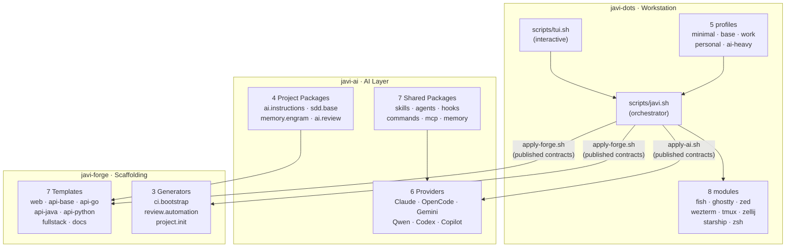

# javi-dots

> **Opinionated development machine setup.** One command to go from a fresh machine to a fully configured workstation with AI coding tools, project scaffolding, and a beautiful terminal environment.

---

## Ecosystem Overview



---

## Quick Start

```bash
git clone https://github.com/JNZader/javi-dots.git
cd javi-dots

# Interactive installer
scripts/tui.sh

# Or direct command
scripts/javi.sh --preset base --home "$HOME"
```

See [Getting Started](/getting-started) for a complete walkthrough.

---

## What's included

- **[Modules](/modules)** — 8 workstation modules: fish, ghostty, zed, wezterm, tmux, zellij, starship, zsh
- **[Profiles](/profiles)** — 5 named profiles: minimal, base, work, personal, ai-heavy
- **[AI Integration](/ai-integration)** — 6 AI providers via javi-ai contracts
- **[Forge Integration](/forge-integration)** — 7 templates + 3 generators via javi-forge contracts
- **[TUI Installer](/tui)** — Interactive whiptail-based setup wizard
- **[Architecture](/architecture)** — All Mermaid diagrams
