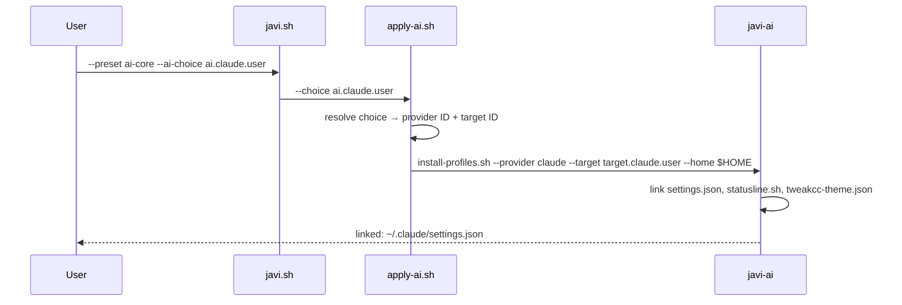

# AI Integration

javi-dots delegates all AI installation to [javi-ai](https://github.com/JNZader/javi-ai) via published contract IDs. It never reads javi-ai's internal directories.

---

## How it works



---

## Supported AI Providers

| Choice ID | Provider | Install target | Config location |
|-----------|----------|---------------|-----------------|
| `ai.claude.user` | Claude Code | `target.claude.user` | `~/.claude/` |
| `ai.opencode.user` | OpenCode | `target.opencode.user` | `~/.config/opencode/` |
| `ai.gemini.user` | Gemini CLI | `target.gemini.user` | `~/.gemini/` |
| `ai.qwen.user` | Qwen Code | `target.qwen.user` | `~/.config/qwen/` |
| `ai.codex.user` | Codex CLI | `target.codex.user` | `~/.codex/` |
| `ai.copilot.repo` | GitHub Copilot | `target.copilot.repo` | `.github/copilot/` |

```bash
scripts/bootstrap/apply-ai.sh --list-choices
```

---

## Presets and AI

| Preset | AI behavior |
|--------|------------|
| `base` | No AI installation |
| `ai-core` | Installs one provider profile only |
| `ai-full` | Installs one provider **+ shared packages** (skills, hooks, instructions) |
| `forge` | No AI installation |
| `full` | Same as ai-full + forge |

### The difference between `ai-core` and `ai-full`

`ai-core` installs the **provider runtime** only — configuration files that customize your AI assistant's behavior, permissions, and appearance.

`ai-full` also installs **shared packages** — reusable assets that work across providers:

| Shared package | Contents |
|---------------|---------|
| `shared.instructions` | AGENTS.md with domain routing and behavior rules |
| `shared.skills` | 16+ skills: SDD workflow, TypeScript, React, Next.js, etc. |
| `shared.hooks` | comment-check.sh, todo-tracker.sh (PostToolUse hooks) |

---

## Applying AI tools

```bash
# Single provider (ai-core)
scripts/javi.sh --preset ai-core --ai-choice ai.claude.user --home "$HOME"

# Provider + shared packages (ai-full)
scripts/javi.sh --preset ai-full --ai-choice ai.claude.user --home "$HOME"

# All providers (ai-heavy profile)
scripts/javi.sh --profile ai-heavy --home "$HOME"
```

---

## What gets installed for Claude

When you install the Claude provider (`ai.claude.user`):

```
~/.claude/
├── settings.json         # Permissions, output style, statusline config
├── statusline.sh         # Custom statusline script
└── tweakcc-theme.json    # Gentleman theme for TweakCC
```

With `ai-full` or shared packages:

```
~/.claude/
├── CLAUDE.md             # Instructions (shared.instructions)
├── agents/               # Domain orchestrators (shared.agents)
├── skills/               # 16+ skills (shared.skills)
├── hooks/                # Hook scripts (shared.hooks)
└── mcp-servers.template.json  # MCP template (shared.mcp)
```

---

## Project-facing packages

When a generated project requests AI capabilities from javi-forge:

| Package ID | What it provides |
|-----------|-----------------|
| `project.ai.instructions` | Provider-neutral AI instructions for the repo |
| `project.sdd.base` | SDD workflow skills and orchestrators |
| `project.memory.engram` | Engram persistent memory setup guide |
| `project.ai.review` | Review hooks (comment-check, todo-tracker) |

These are consumed by javi-forge templates, not installed by javi-dots directly.

---

## MCP servers

javi-ai includes a template for MCP server configuration. After installing:

```bash
# Copy and customize the template
cp ~/.claude/mcp-servers.template.json ~/.claude/mcp-servers.json
# Then edit: replace placeholder API keys with real values
```

Included servers: context7 · engram · brave-search · sentry · cloudflare · notion
