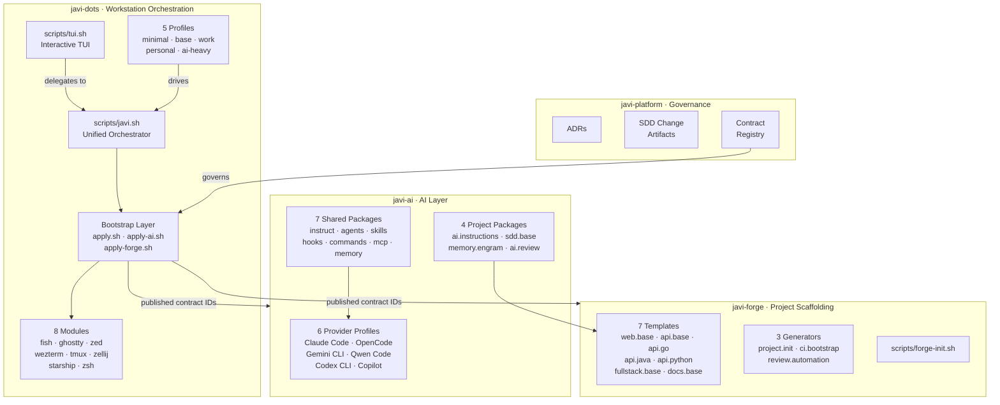
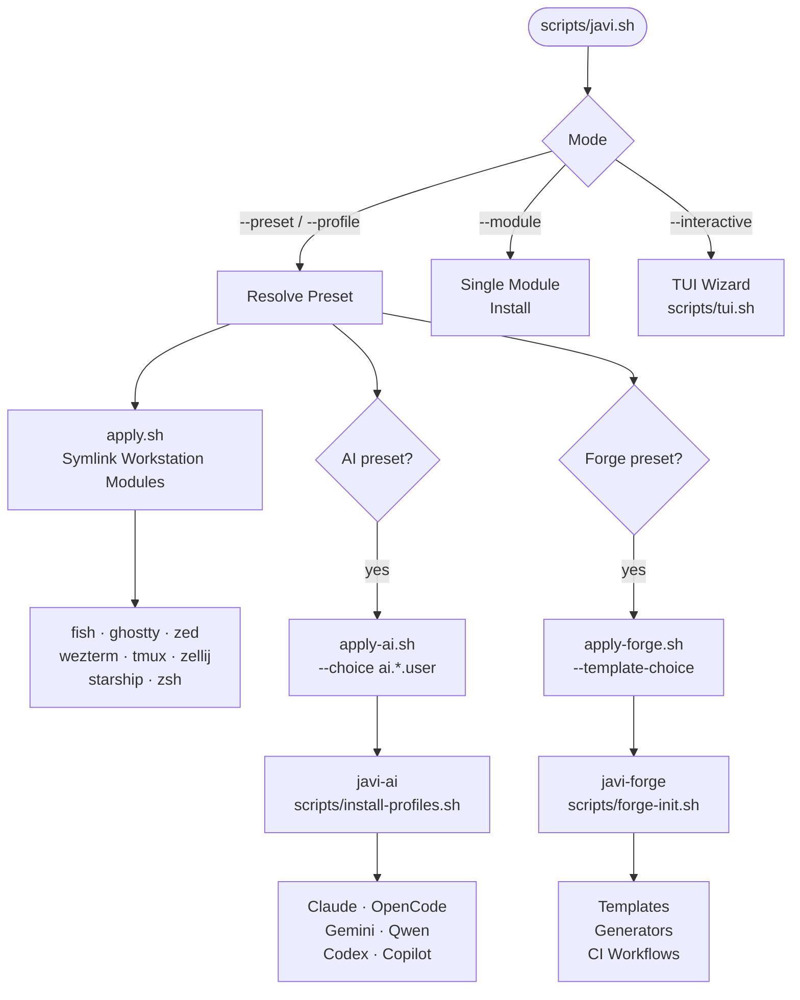
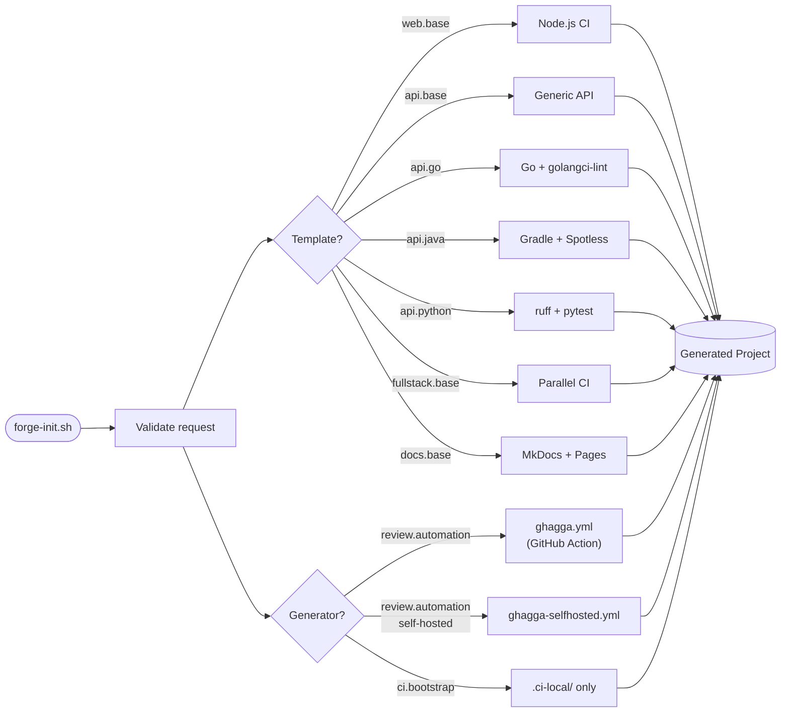
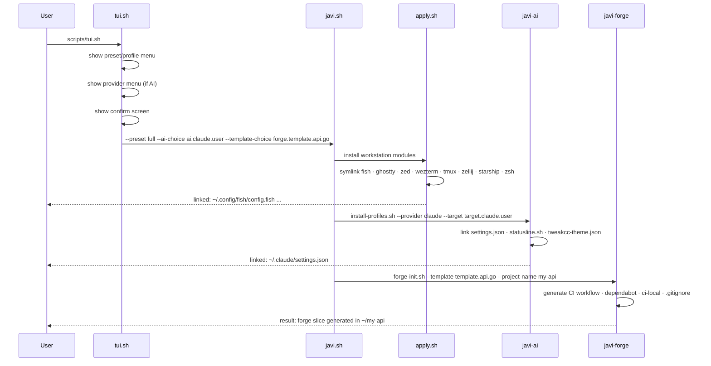
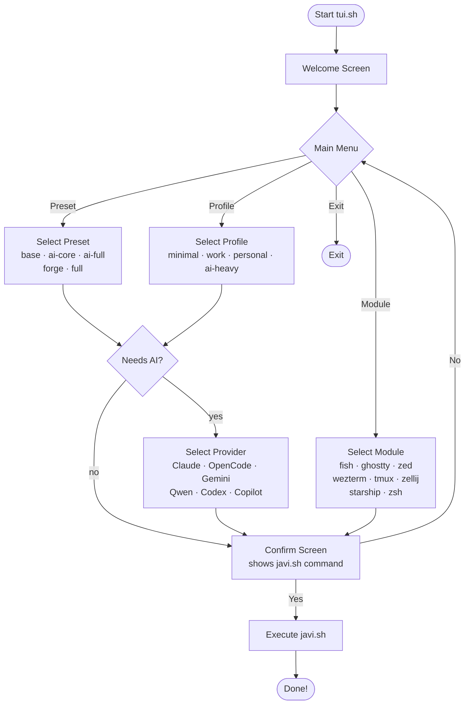

# Architecture

All Mermaid diagrams for the javi ecosystem in one place.

---

## Ecosystem Architecture

The four repos and their relationships:

---

## javi-dots Orchestration Flow

How `javi.sh` routes work to the bootstrap layer:

---

## javi-ai Provider and Package Architecture

How shared packages compose into provider profiles and project packages:

```mermaid
graph TD
    subgraph SHARED["Shared Packages"]
        SI["shared.instructions"]
        SA["shared.agents"]
        SK["shared.skills"]
        SH["shared.hooks"]
        SC["shared.commands"]
        SM["shared.mcp"]
        SME["shared.memory"]
    end

    subgraph PROVIDERS["Provider Profiles"]
        PC["provider.claude.core\n→ ~/.claude/"]
        PO["provider.opencode.core\n→ ~/.config/opencode/"]
        PG["provider.gemini.core\n→ ~/.gemini/"]
        PQ["provider.qwen.core\n→ ~/.config/qwen/"]
        PX["provider.codex.core\n→ ~/.codex/"]
        PP["provider.copilot.core\n→ .github/copilot/"]
    end

    subgraph PROJECT["Project Packages"]
        PAI["project.ai.instructions"]
        PS["project.sdd.base"]
        PME["project.memory.engram"]
        PR["project.ai.review"]
    end

    SI --> PC & PO & PG & PQ & PX & PP
    SA --> PC & PO
    SK --> PC & PO
    SH --> PC
    SC --> PO
    SME --> PME

    SI --> PAI
    SI & SA --> PS
    SI & SME --> PME
    SH & SA & SI --> PR
```

---

## javi-forge Template and Generator Flow

How forge-init.sh routes templates and generators:

---

## Bootstrap Sequence

End-to-end flow from TUI to installed workstation:

---

## TUI Menu Flow

