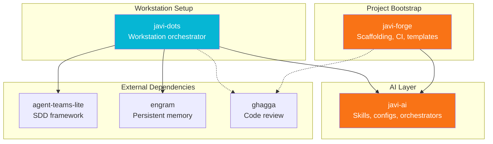
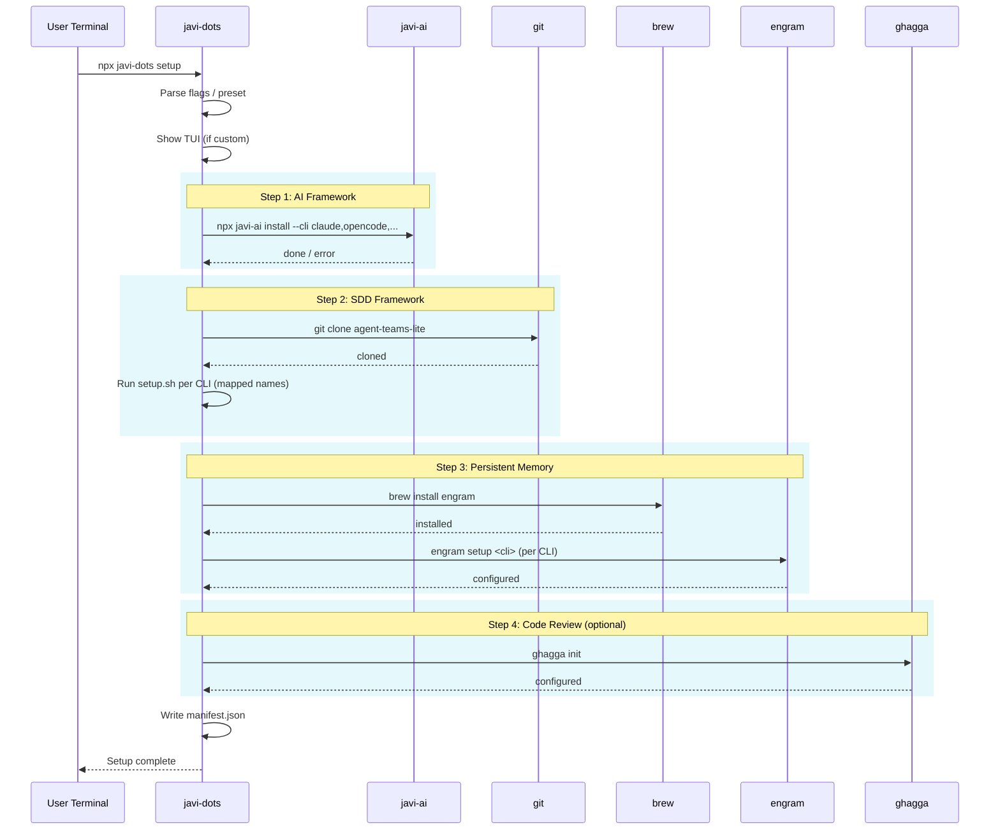
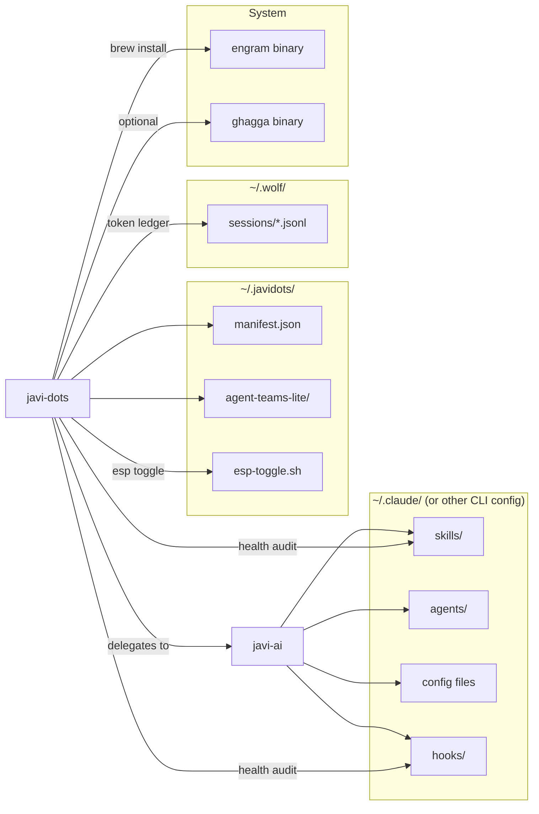

# Architecture

## Ecosystem Overview

`javi-dots` is one of three npm packages that form the developer platform:



## Setup Flow

The setup command runs four sequential steps. Each step reports its status in real-time through the Ink TUI.



## Component Relationships



## Orchestrator Modules

The `src/orchestrator/` directory contains the implementation for each command:

| Module | Command | Description |
|--------|---------|-------------|
| `index.ts` | `setup` | Main setup orchestrator |
| `doctor.ts` | `doctor` | Installation health check |
| `update.ts` | `update` | Re-run setup from manifest |
| `uninstall.ts` | `uninstall` | Clean removal |
| `health.ts` | `health` | AI config quality audit |
| `esp.ts` | `esp` | ESP tmux integration |
| `mcp.ts` | `mcp` | MCP server auto-setup |
| `tokens.ts` | `tokens` | Token tracking and reporting |
| `nano.ts` | `nano` | SDD-lite inline workflow |
| `utils.ts` | — | Shared utilities (`which`, `readFileIfExists`, `tokenEstimate`) |

## Manifest Format

The manifest at `~/.javidots/manifest.json` tracks the installation state:

```json
{
  "version": "0.1.0",
  "installedAt": "2025-01-15T10:30:00.000Z",
  "updatedAt": "2025-01-15T10:30:00.000Z",
  "clis": ["claude", "opencode"],
  "engram": true,
  "sdd": true,
  "ghagga": false
}
```

The `update` command re-reads this manifest and runs setup with the same configuration. The `uninstall` command reads it to know what to clean up.

## Tech Stack

| Component | Technology |
|-----------|------------|
| CLI framework | [meow](https://github.com/sindresorhus/meow) |
| TUI rendering | [Ink](https://github.com/vadimdemedes/ink) (React for CLI) |
| Language | TypeScript (strict) |
| Runtime | Node.js 18+ |
| Testing | Vitest + Stryker mutation testing |
