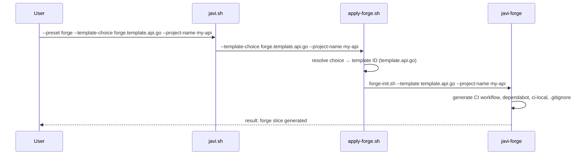

# Forge Integration

javi-dots delegates all project scaffolding to [javi-forge](https://github.com/JNZader/javi-forge) via published contract IDs. It never reads javi-forge's internal template directories.

---

## How it works



---

## Available Templates

| Choice ID | Template ID | Stack | CI |
|-----------|------------|-------|-----|
| `forge.template.web.base` | `template.web.base` | Node.js | Node CI |
| `forge.template.api.base` | `template.api.base` | Any (generic) | Language-agnostic |
| `forge.template.api.go` | `template.api.go` | Go | golangci-lint + go test |
| `forge.template.api.java` | `template.api.java` | Java / Spring Boot | Spotless + Gradle test |
| `forge.template.api.python` | `template.api.python` | Python / FastAPI | ruff + pytest |
| `forge.template.fullstack.base` | `template.fullstack.base` | Any frontend+backend | Parallel jobs |
| `forge.template.docs.base` | `template.docs.base` | MkDocs | Build + GitHub Pages |

```bash
scripts/bootstrap/apply-forge.sh --list-choices
```

---

## Available Generators

| Choice ID | Generator ID | Output | Mode |
|-----------|-------------|--------|------|
| `forge.generator.review.automation` | `generator.review.automation` | `ghagga.yml` | github-action |
| `forge.generator.review.automation` | `generator.review.automation` | `ghagga.yml` | self-hosted |

---

## Generating a project

### Via javi.sh (recommended)

```bash
# Dry-run first
scripts/javi.sh --preset forge \
  --template-choice forge.template.api.go \
  --project-name my-api \
  --destination ~/projects \
  --home "$HOME" \
  --dry-run

# Apply
scripts/javi.sh --preset forge \
  --template-choice forge.template.api.go \
  --project-name my-api \
  --destination ~/projects \
  --home "$HOME"
```

### With review automation

```bash
scripts/javi.sh --preset forge \
  --template-choice forge.template.api.python \
  --generator-choice forge.generator.review.automation \
  --project-name my-api \
  --destination ~/projects \
  --home "$HOME"
```

### Full setup (base + AI + forge)

```bash
scripts/javi.sh --preset full \
  --ai-choice ai.claude.user \
  --template-choice forge.template.web.base \
  --project-name my-app \
  --home "$HOME"
```

---

## Generated output

Every template produces a ready-to-use project structure:

```
my-project/
├── .github/
│   ├── workflows/
│   │   ├── ci.yml                  # Stack-specific CI
│   │   └── dependabot-automerge.yml
│   └── dependabot.yml
├── .ci-local/                       # Local CI simulation
│   ├── ci-local.sh
│   ├── install.sh
│   ├── semgrep.yml
│   └── hooks/
│       ├── pre-commit
│       ├── commit-msg
│       └── pre-push
├── lib/
│   └── common.sh
└── .gitignore
```

The `docs` template additionally generates `mkdocs.yml.example` and `docs/index.md`.

---

## CI Bootstrap (standalone)

Add CI tooling to an existing project without a full template:

```bash
scripts/javi.sh --preset forge \
  --generator-choice forge.generator.ci.bootstrap \
  --project-name existing-project \
  --destination ~/existing-project \
  --home "$HOME"
```

This copies the `.ci-local/` family without generating a CI workflow.

---

## AI Review Automation

The `generator.review.automation` generator adds AI-powered code review to any project:

```bash
# GitHub Action mode (free, uses GitHub Models)
scripts/javi.sh --preset forge \
  --generator-choice forge.generator.review.automation \
  --project-name my-project \
  --destination ~/projects \
  --home "$HOME"
```

The generated `ghagga.yml` workflow:
- Triggers on every pull request
- Uses the free GitHub Models provider by default
- Enables cross-PR memory learning
- Advisory mode by default (won't block PRs)
