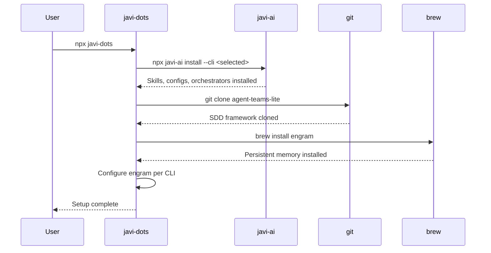

# Getting Started

## Prerequisites

Before running `javi-dots`, make sure you have:

1. **Node.js 18+** — [nodejs.org](https://nodejs.org)
2. **git** — required for cloning the SDD framework
3. **Homebrew** — required for installing engram ([brew.sh](https://brew.sh))

Verify your setup:

```bash
node --version   # v18.0.0 or higher
git --version    # any recent version
brew --version   # Homebrew 4.x
```

## Step 1: Run the Installer

The simplest way is to run with `npx` — no global install needed:

```bash
npx javi-dots
```

This launches the interactive TUI where you:

1. **Select AI CLIs** — pick which coding assistants you use (Claude, OpenCode, Gemini, Qwen, Codex, Copilot)
2. **Enable/disable ghagga** — optional multi-agent code review
3. **Confirm** — review your selections and proceed

## Step 2: Wait for Installation

`javi-dots` runs four steps in sequence:



Each step shows its status in real-time: running, done, error, or skipped.

## Step 3: Verify the Installation

Run the doctor command to check everything is healthy:

```bash
npx javi-dots doctor
```

This checks:

- **Manifest** — `~/.javidots/manifest.json` exists
- **javi-ai** — binary available in PATH
- **engram** — binary available in PATH
- **git** — binary available in PATH
- **agent-teams-lite** — cloned to `~/.javidots/agent-teams-lite/`
- **ghagga** — binary available (optional)
- **Each configured CLI** — binary available in PATH

## Non-Interactive Usage

For CI or automated scripts, use presets or explicit flags:

```bash
# Full setup, no prompts
npx javi-dots --preset full

# Minimal (Claude only)
npx javi-dots --preset minimal

# Specific CLIs with explicit ghagga toggle
npx javi-dots setup --cli claude,opencode --ghagga

# Dry run to preview
npx javi-dots setup --preset full --dry-run
```

## Next Steps

- **Start a new project** — use [javi-forge](https://github.com/JNZader/javi-forge) to scaffold with CI and AI config
- **Update later** — run `npx javi-dots update` to re-apply your config
- **Uninstall** — run `npx javi-dots uninstall` for clean removal
