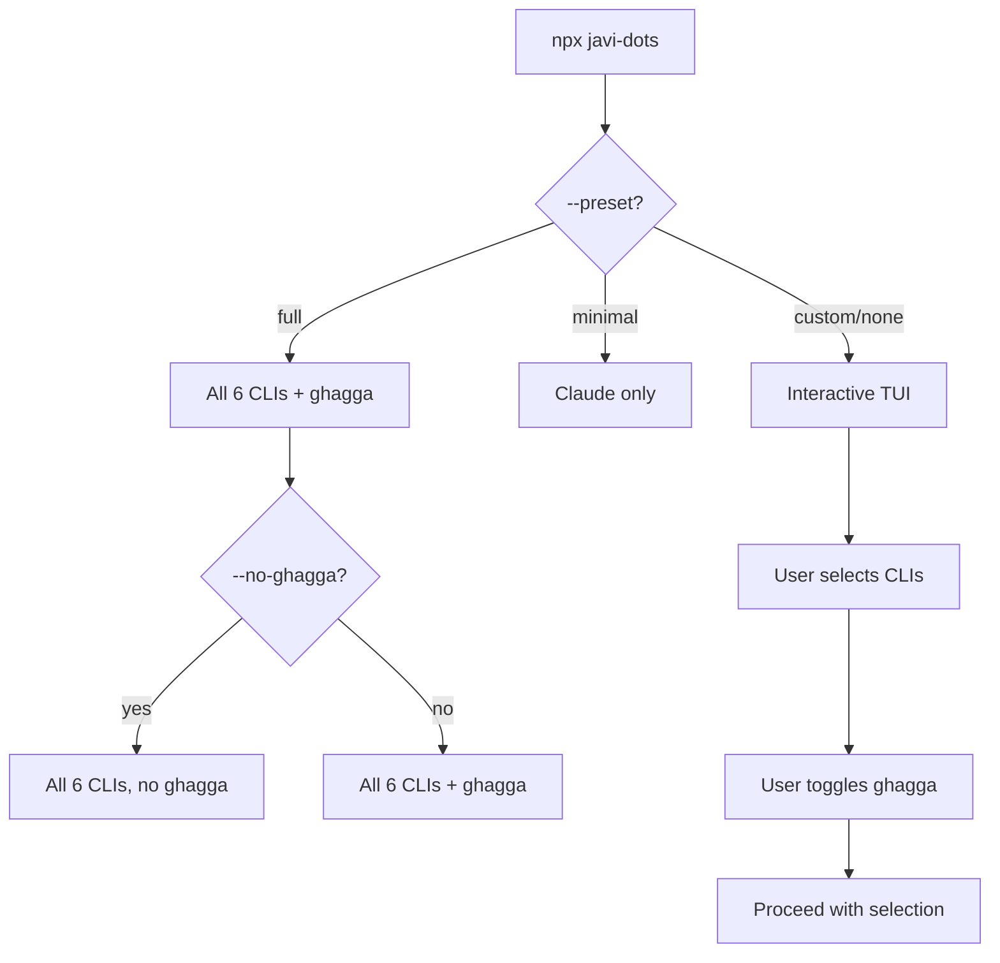

# Presets

Presets let you skip the interactive TUI by pre-selecting a configuration.

## full

Installs support for all 6 AI CLIs with ghagga enabled.

```bash
npx javi-dots --preset full
```

| Setting | Value |
|---------|-------|
| CLIs | Claude, OpenCode, Gemini, Qwen, Codex, Copilot |
| ghagga | Enabled |
| TUI | Skipped |

This is the "give me everything" option. Good for a fresh workstation setup where you want maximum coverage.

## minimal

Installs Claude Code only, no ghagga.

```bash
npx javi-dots --preset minimal
```

| Setting | Value |
|---------|-------|
| CLIs | Claude only |
| ghagga | Disabled |
| TUI | Skipped |

Good for quick setups or when you only use Claude Code.

## custom (default)

Launches the interactive TUI for manual selection.

```bash
npx javi-dots
# or explicitly:
npx javi-dots --preset custom
```

| Setting | Value |
|---------|-------|
| CLIs | Your choice |
| ghagga | Your choice |
| TUI | Full interactive |

## Overriding Presets

Flags override preset values. For example, you can use the full preset but disable ghagga:

```bash
npx javi-dots --preset full --no-ghagga
```

Or use a preset as a starting point and add specific CLIs:

```bash
npx javi-dots --cli claude,opencode --ghagga
```

When both `--cli` and `--ghagga`/`--no-ghagga` are provided (without a preset), the TUI is skipped automatically.

## Comparison


