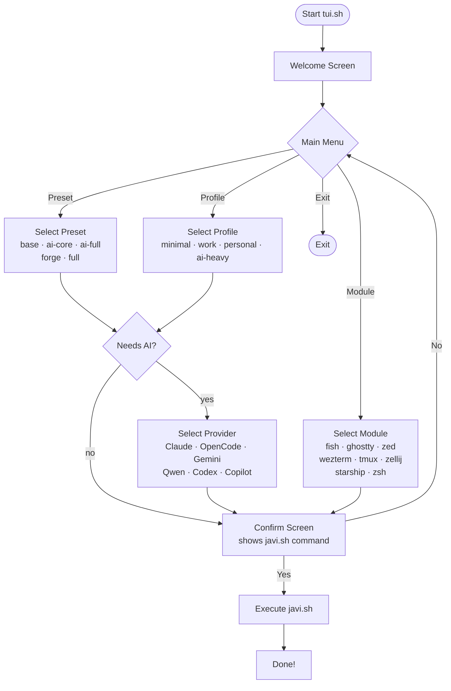

# TUI Installer

javi-dots includes an interactive terminal installer built with `whiptail`. It guides you through the full setup process without requiring you to memorize any flags.

---

## Launch

```bash
scripts/tui.sh              # interactive mode
scripts/tui.sh --dry-run    # preview without executing
```

---

## Requirements

The TUI uses `whiptail` (part of the `newt` package):

```bash
# macOS
brew install newt

# Ubuntu/Debian
sudo apt install whiptail

# Fedora/RHEL
sudo dnf install newt
```

If `whiptail` is not available, the TUI falls back to plain `read`-based prompts — the same flow, just without the graphical menus.

---

## Menu flow



---

## What it does

1. **Welcome screen** — shows your home directory and whether dry-run mode is active
2. **Main menu** — choose between preset, profile, single module, or exit
3. **Preset/Profile selection** — pick from a menu of options
4. **Provider selection** — if the chosen preset/profile includes AI, pick your provider
5. **Confirm screen** — shows the exact `javi.sh` command that will be run
6. **Execute or cancel** — apply changes or return to the main menu

---

## Dry-run mode

```bash
scripts/tui.sh --dry-run
```

In dry-run mode:
- The welcome screen shows "DRY-RUN MODE"
- All planned actions are printed without touching the filesystem
- Useful for previewing what would happen before committing

---

## Example session

```
Welcome to javi-dots interactive installer!
Your home directory: /home/javi
[OK]

┌──── Main Menu ─────────────────────────────┐
│                                            │
│ What would you like to do?                 │
│                                            │
│  ○ preset   Apply a preset                 │
│  ○ profile  Apply a named profile          │
│  ○ module   Install a single module        │
│  ○ exit     Exit without making changes    │
│                                            │
└────────────────────────────────────────────┘

> Profile selected

┌──── Select Profile ────────────────────────┐
│  ○ minimal  Base workstation only          │
│  ● work     base + one AI provider         │
│  ○ personal base + ai-full + forge         │
│  ○ ai-heavy base + all 6 providers         │
└────────────────────────────────────────────┘

┌──── AI Provider ───────────────────────────┐
│  ● ai.claude.user    Claude Code           │
│  ○ ai.opencode.user  OpenCode              │
│  ○ ai.gemini.user    Gemini CLI            │
│  ...                                       │
└────────────────────────────────────────────┘

┌──── Apply profile: work ───────────────────┐
│                                            │
│ Command to execute:                        │
│                                            │
│   scripts/javi.sh --profile work           │
│     --ai-choice ai.claude.user             │
│     --home /home/javi                      │
│                                            │
│ Proceed?    [Yes]  [No]                    │
└────────────────────────────────────────────┘
```
